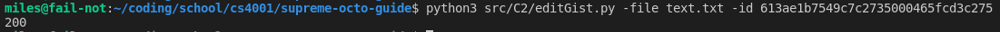

# Implant Prototype
****************************************************************
## Command and Control Design:
### Master Server Location
Master Server will be hosted on a VPS through a provider such as Linode (affordable options
that may have free trials). In an ideal scenario, a bulletproof VPS would be used; however,
bulletproof hosters are much less affordable. Any payment (if needed) for the server will be
separated from any operator(s) by using prepaid card.

### Communication Medium/Proxy
As can be seen in the [diagram below](#communication-diagram), commands will be uploaded to a GitHub gist with additional details being found in a burn-on-read pastebin, which will be encoded in the story in the gist. The implant will parse the inputs from the gist story and take action accordingly. Detailed command execution will be in the burn-on-read pastebin that’s encoded within the story as well. This burn-on-read option allows for the secondary pastebin to destruct after being accessed.

Files will be uploaded through file sharing sites that do not require accounts such as sendgb/swisstransfer‒both of which have an email sharing function. When going from C2 to implant, the files will be accessed by link and have limited download count (1 unless situation calls for more). When exfiltrating files from the implant, it will be uploaded to the file sharing site and immediately sent to a burner email which the C2 server will then access and download the file. These emails have the option of being hardcoded before each implant or encoded within the pastebin story, most likely the latter option will be utilized. Operator connection to the C2 server will be through TOR so that likelihood of operator being compromised is lessened. In addition, the operator(s) may access the gists/pastebin through TOR; however, this will not be theprimary method of uploading commands and is reserved primarily for if the master server is compromised and the implant needs to be destroyed.

### Communication Encoding
Encoding scheme will be done with keywords in the GitHub gist which will then be parsed by the
implant. Additionally, any commands that are not encoded with keywords (such as the
detailing pastebin for command execution), will be encoded with either base64 or with a
password as detailed in the primary pastebin.

### Uploading Macros (Prototyped)
As stands for the C2 side of the prototyping, macros for command exectution were made. [postGist.py](src/C2/postGist.py) and [editGist.py](src/C2/editGist.py) are both used for making and editing (respectively) a GitHub gist. They take in files for reading the input and use the GitHub api to make the requests. There is, however, a potential limitting factor: rate limits. To address this, multiple accounts with multiple-api keys will be used. This will allow for the rate limit to be circumvented in the case that the need arises. If a better method is found, it will be altered to that. 

Eventually, there will be templated story generators that edit the text based on the need for the gist. 

#### A switch from pastebin
Initially paste bin was going to be used for the central repository, however, there was no option to have a paste editted through an API, and thus made the idea of using macros to swap main commands from the C2 unachievable. 

#### Addition of a Reverse Shell
While a reverse shell was not originally planned to be directly implemented, since the operation had limitted time it was worthwhile to consider. Whether it will stand in its final form depends on how extensive the macros of the implant go. However, I am hesitant in implementing this as it shortens the gap between operator(s) and implant(s). ~~OP Sec is of a much higher priority to the team than is mission completion. Just can't risk~~ The whole point of the schema was to distance the C2 server from the implant, so it would be against the intent of the design. However, with the use of TOR as a multi-hop proxy and the server being purchased out-of-name, it will be considered regardless.

## Updated Communication Diagram

## Implant Design

#### Prototype implemented in python, may be changed in future. Mainly serves as a POC. May Cythonize it as well.

### Distribution Method
Distribution can be achieved through a number of methods depending on the target device. For
example, if the target device is an android phone, social engineering could be used to convince
a target to install an APK from a third party app host; this APK would contain the implant within
it. (The details of the cover program for the APK are not important and could be targeted based
on the target). The implant could also be installed if an exploit allows for files to be uploaded
and executed as seen with the midterm, in this case the file could be uploaded as a binary and
executed.
### Evasion Techniques
Under ideal scenarios the target will install the implant themselves in some application that they
were convinced to install. However, if that is unable to happen, there are a few things that may
be done:
● If possible, the implant will be installed in places in which are unlikely to be searched.
● In addition it may be hidden. [(See Additional Functionality: Hiding Itself)](#hiding-itself) for more detail.
### Base Functionality
#### File Exfiltration:
**Keyword: dealership (buy/sell)**
**buy: download**
**sell: upload**
Files will be uploaded to file sharing sites like sendgb or swisstransfer. Files will be sent
to a burner email (by the file sharing site) as instructed by the commands in the pastebin.
Likewise, files can be retrieved based on a URL from sendgb or swisstransfer as directed in the
primary Gist. Not yet implemented
#### Directory Traversal:
**Achieved via command execution**
The implant will interface with the system for directory traversal. Since it will likely be
implemented in C++, the system() function would be used for this to execute sh/bash/batch
depending on the OS.
#### Command Execution:
**Keyword: marketplace**
Commands will be encoded in the primary Gist cover story, the implant will then
parse and respond according to the commands coming from the pastebin which is hidden in the .
#### Self Destruction:
**Keyword french bread**
Upon receiving an indicator from the master server, the implant will delete itself. In
addition, the implant will check for any active tools that may compromise it (such as Ghidra or
Frida) and attempt to kill the process. If killing the process fails it will self-destruct and kill its own
process.
### Persistence Mechanism
The implant will implement the necessary checks and calls based on the OS. For instance, on
linux devices, the implant will create a cronjob (if non-existant) associated with executing the
implant. On a packaged APK version, the implant will listen for the “BOOT_COMPLETED”
broadcast.
On demand, may allow for the implant to create a hidden copy of itself. 
See [Additional Functionality: Hiding Itself for more detail](#hiding-itself)

### Additional Functionality
What additional actions do we want our implant to perform on device?
#### Gist Pivoting:
**Not yet designed, considering options, rate limit issues require API keys as well, more investigation needed**
In the case that there is suspect of the primary Gist being compromised, a command can
be issued to pivot to a new primary Gist. This would also essentially allow for new
Gist to be issued as desired, allowing for the primary Gist to be changed between
each command. It would be; however, essential to keep track of what the implant perceives as
the primary paste bin.
#### Hiding Itself:
**Keyword: hide**
Implant may make a copy of itself and hide itself when issued a command from C2 via the
primary gist. This will be done if it is suspected that the target wants to uninstall the implant
(if they installed it themselves) or if it may be detected soon.
#### Permanent Death:
**Keyword: french bread**
Implant will delete itself from the disk and kill its process.
Defense/Obfuscation Mechanisms
Messages to the implant will be embedded in a pastebin “story”. The story will be edited at
specific points to send commands to the implant. The implant will parse the story and search for
specific signals within the story. In addition, lengthy commands, such as shell commands, will
have a secondary pastebin that contains the full command. This secondary pastebin will be
encoded, the implant will decode this as the pastebin “story” command suggests.
Upon receiving an indicator from the master server, the implant will delete itself. In addition, the
implant will check for any active tools that may compromise it (such as Ghidra or Frida) and
attempt to kill the process. If killing the process fails it will self-destruct and kill its own process.

## Example Usage
### Editing the Gist from C2

**NOTE: Implants Distinguish which files is their based off their "favorite_character" which is based on the name of the txt file. There will be multiple characters with multiple stories, which will also help with disguising activity since all stories will be fetched. In this case, the implant's favorite character was text**

### Running the implant to get the command (non-burning)

Implant will not execute if the command doesn't change in the gist, instead it will just do nothing. "Same ol' story" just to show this. Was run on this pastebin (unencoded to show)
https://pastebin.com/raw/a0SFhaNt